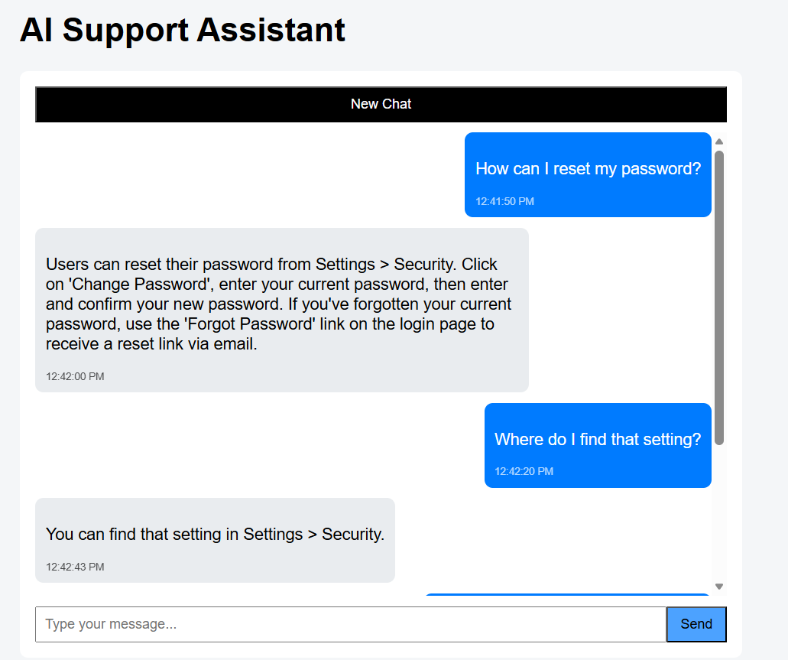
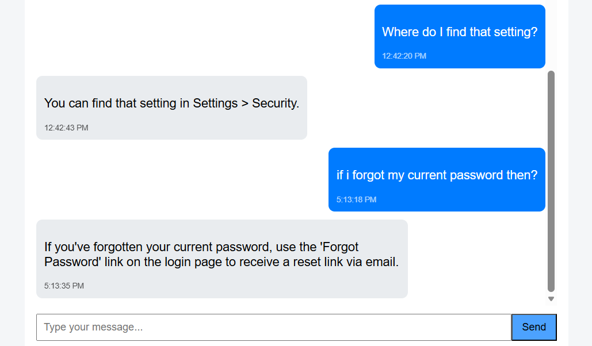
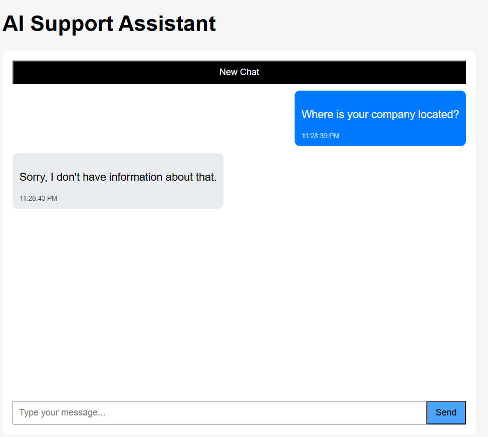

# 🧪 AI-Powered Support Assistant

A full-stack AI-powered customer support assistant built using:

- ⚛ React.js (Frontend)
- 🚀 Node.js + Express (Backend)
- 🗄 SQLite (Database)
- 🤖 Google Gemini API (LLM)

## 📌 Features

- Chat-based UI
- Session-based conversation handling
- Stores conversations in SQLite
- Maintains last 5 user + assistant message pairs as context
- Strict document-only answering (docs.json)
- Rate limiting per IP
- New Chat functionality
- Token usage tracking

## 🧠 LLM Rules

- The assistant answers only using `docs.json`
- No hallucination allowed
- If answer not found, it responds:

>    "Sorry, I don't have information about that."

---

## 🗂 Project Structure

/frontend
/backend
/screenshots

## ⚙ Backend Setup

cd backend
npm install

Create `.env` file:

GEMINI_API_KEY=your_api_key_here
PORT=5001

Run backend:
npm start

## ⚙ Frontend Setup

cd frontend
npm install
npm run dev

## 🔗 API Endpoints

### POST `/api/chat`
Send message to assistant.

### GET `/api/conversations/:sessionId`
Fetch conversation history.

### GET `/api/sessions`
List all sessions.

## 🗄 Database Schema

### sessions
- id (TEXT, Primary Key)
- created_at
- updated_at

### messages
- id (INTEGER)
- session_id (TEXT)
- role (user / assistant)
- content (TEXT)
- created_at (DATETIME)

## 📷 Screenshots

### 💬 Chat Interface

### ❌ Strict Document Rule Enforcement

## 🚀 Deployment

Backend can be deployed on:
- Render
- Railway

Frontend can be deployed on:
- Vercel
- Netlify

Note: SQLite is used as required by the assignment. For production systems, PostgreSQL would b
